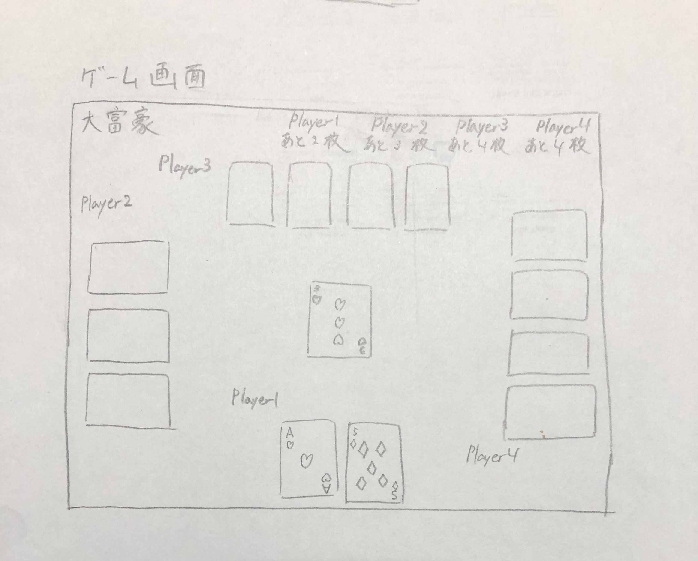

# オブジェクト指向プログラミングおよび演習 第12回進捗レポート

## 作成者
- 学籍番号：[kk]21006
- 氏名：石川結衣
- グループ： 1
    - メンバー
        - K21006 石川結衣（チームリーダー）
        - K21007 石垣蓮
        - K21030 小川滉太
        - K21038 門田真一朗
        - K21071 須田倫代
        - K21073 高林大渡
        - K21093 西山桃花

## 仕様
- 大富豪ができるGUIアプリケーション
- 人数は4人固定

## アプリ完成イメージ
- （start_page.jpgもMoodleへアップロードした）
- （game_page.jpgもMoodleへアップロードした）

## 作業分担
- PySide6を用いたクライアント側の作成（担当：石垣蓮・西山桃花）
- ソケット通信で通信側の作成（担当：門田真一朗・須田倫代）
- サーバ側の作成（担当：小川滉太・高林大渡）
- トップページの作成（担当：須田倫代）
- ページ遷移（担当：門田真一朗）

## 作業報告
- 先生・メンバーと相談してクライアント側のライブラリをPySide6に変更
- クライアント側の画像表示の実装方法を調べた
- 完成イメージイラストの変更
- 大体できたサーバ側担当の2人に、人手が足りていないクライアント側に回ってもらった
- メンバーからきたプルリクエストの確認・修正依頼・マージ
    - https://github.com/2022AIT-OOP2-G01/final/pull/2
    - https://github.com/2022AIT-OOP2-G01/final/pull/4
    - https://github.com/2022AIT-OOP2-G01/final/pull/5
    - https://github.com/2022AIT-OOP2-G01/final/pull/6

## グループ内でお世話になった人2〜3名を理由とともに挙げる
- 自分がクライアント側のヘルプに回っている間サーバ側と通信側をまとめてくれた(K21073 高林大渡)
- クライアント側の描写方法を一緒に考えてくれた(K21007 石垣蓮)

## 振り返り（感想含む）と次回までの作業予定
- クライアント側のライブラリの変更でかなり授業時間を使ってしまったのが痛手だった
- ライブラリ変更の間、残りのメンバーを高林くんがまとめて、指示を出してくれていたのがとても助かった
- クライアント側と、それぞれの接続部分（変数の指定など）ができていないので完成させる
- 余裕のある人にスライドの作成をしてもらう