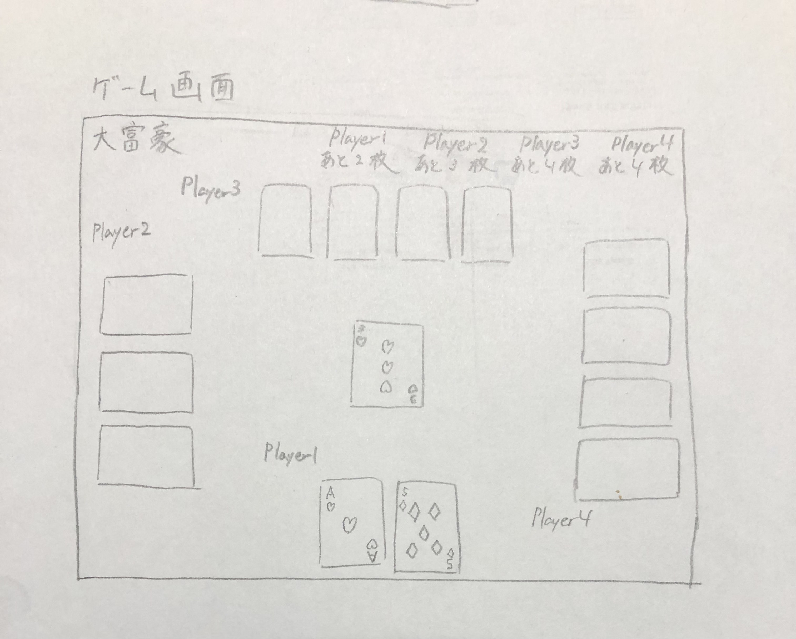

# オブジェクト指向プログラミングおよび演習 第14回進捗レポート

## 作成者
- 学籍番号：[kk]21006
- 氏名：石川結衣
- グループ： 1
    - メンバー
        - K21006 石川結衣（チームリーダー）
        - K21007 石垣蓮
        - K21030 小川滉太
        - K21038 門田真一朗
        - K21071 須田倫代
        - K21073 高林大渡
        - K21093 西山桃花

## 仕様
- 大富豪ができるGUIアプリケーション
- ソケット通信で4人の人数固定の通信対戦
- 含まれているルール（８切り・１１バック・５飛ばし）

## アプリ完成イメージ
- ゲーム画面
（game_page.jpgもMoodleへアップロードした）

## 作業分担
- PySide6を用いたクライアント側の作成（担当：石垣蓮・西山桃花・石川結衣）
- ソケット通信で通信側の作成（担当：門田真一朗・須田倫代・高林大渡）
- ルールの追加・ロード中画面で使用するGIF画像の作成（担当：小川滉太）
- ロード中画面の作成（担当：門田真一朗）
- 通信側・クライアント側の接続（担当：高林大渡・須田倫代）

## 作業報告
- 石垣君・西山さんと共にクライアント側（手札表示の方法等）を調べた
- 手が空いた門田君・須田さん・小川君に通信側の作成・ルールの追加・ロード中画面の作成を任せた
- Teamsで会議を開き、全体で動作確認と細かい修正・スライドの作成を行った
- メンバーからきたプルリクエストの確認・修正依頼・マージ
    - https://github.com/2022AIT-OOP2-G01/final/pull/7
    - https://github.com/2022AIT-OOP2-G01/final/pull/8
    - https://github.com/2022AIT-OOP2-G01/final/pull/9
    - https://github.com/2022AIT-OOP2-G01/final/pull/10
    - https://github.com/2022AIT-OOP2-G01/final/pull/11
    - https://github.com/2022AIT-OOP2-G01/final/pull/13
    - https://github.com/2022AIT-OOP2-G01/final/pull/14
    - https://github.com/2022AIT-OOP2-G01/final/pull/15
    - https://github.com/2022AIT-OOP2-G01/final/pull/17

## グループ内でお世話になった人2〜3名を理由とともに挙げる
- 通信側の作成・クライアント側との接続を中心となってやってくれた(K21073 高林大渡)
- クライアント側の描写方法を一緒に考えてくれた(K21007 石垣蓮)

## 振り返り（感想含む）と次回までの作業予定
- フィールドに出ているカード等をターン毎に更新する方法が難しかった
- Teamsの会議で動作確認をしている間に新たに色々なバグが見つかって大変だった
- 内容的に1回の動作確認に時間がかかるので会議の時間が思っていた以上に伸びてしまった
 
- 余裕のある人にスライドの作成をしてもらう